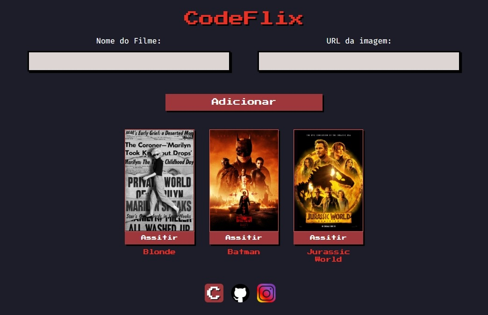

# 📽️ CodeFlix

Um projeto muito simples, onde é possível o usuário adicionar cards de filmes.

Tudo isso graças a essa [playlist](https://www.youtube.com/playlist?list=PLirko8T4cEmzTC2mv2BwOSSrK0ZZPnZH9), feita pelo [Marcos Bruno](https://www.youtube.com/@MarcoBrunoDev) do Youtube, Thank You!

Veja ele [aqui](https://matheusfdosan.github.io/codeflix/)

## 👨‍💻 Techs

- HTML
- CSS
- Animations CSS
- Media Queries CSS
- JavaScript Dom
- GIT

## 📞 Contato

- Acesse também meus outros repositórios no [Github](https://github.com/matheusfdosan)
- Também me siga no [Instagram](https://instagram.com/matheusfdosan)
